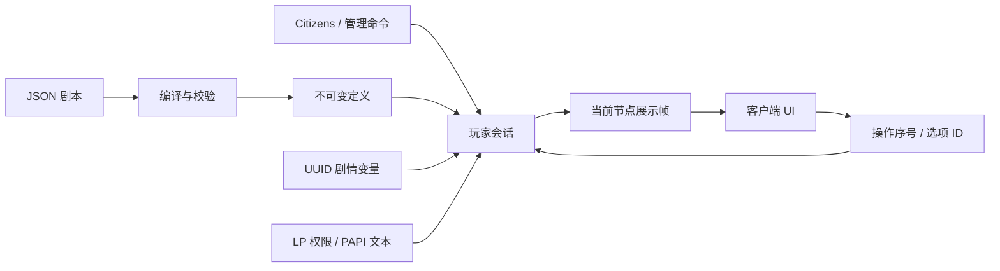

# 对话核心

## 职责

- `core/`：编译剧本、条件、玩家变量、随机/文本模板与会话状态机，不依赖 Minecraft 或 Bukkit。
- `server/DialogCatalog`：后台构建完整目录，主线程发布不可变快照；配置覆盖数据包，失败保留旧目录。
- `server/ServerDialogSessions`：绑定真实玩家、创建上下文、管理会话、投递当前展示帧。
- `server/ServerDialogContext`：把变量存储、玩家信息、可选插件能力和旧命令适配到核心。
- `server/BukkitIntegrations`：可选 Youer 适配，权限查询交给 Bukkit/LP，文本交给 PAPI。跨类加载器反射只集中在这里，缓存调用入口。
- `server/SavedDialogVariables`：当前基于 Minecraft SavedData 的 UUID 存储。
- `client/`：接收已解析展示帧、保存本地历史、处理用户意图、缓存文本组件与排版。
- `ui/`：沿用已有立绘、背景、物品和按钮显示。
- `network/`：仅保留 Action 和 Frame，两端协议为 3。

## 数据流

## 不变量

1. 客户端不提供命令、变量值、玩家 UUID 或跳转目标。
2. 选项必须属于当前已提供集合，并在提交时再次满足条件；会话归属与修订号必须匹配。
3. 变量修改先校验，再消费操作、提交变量和执行兼容动作；重入与重复请求不能再次消费同一步。
4. 定义不会因为某个玩家的条件而被删除、修改或克隆成另一份图。
5. 一次节点访问只抽取一次随机模板；刷新解析动态值但保留所选模板。
6. PAPI 在服务器生成展示数据时调用；客户端不会查询插件或接收完整脚本。
7. 新开场和热重载不会覆盖其他玩家的会话。命令重入创建的新会话也不能被旧会话的确认覆盖。
8. 旧命令是可信配置的兼容出口，不保证外部插件事务性；当前去重不跨重启或跨服务器。

## 后续跨服

目前核心已经有稳定节点 ID、可选显式选项 ID、定义版本、UUID 变量和独立上下文。后续可以替换服务端存储适配，而不改变 when/set/random 的配置写法。

跨服仍需要明确的变量加载、会话快照、定义版本对齐、目标服接管、旧服写入隔离和动作去重。当前 SavedData 不能被当作共享数据库。NPC 生命周期继续由 Citizens 管理。
